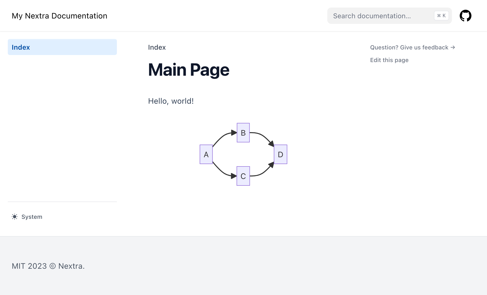

# Nextra Mermaid

Starting today, Nextra supports rendering Mermaid diagrams.

- The feature request issue: https://github.com/shuding/nextra/issues/1373
- The pull request: https://github.com/shuding/nextra/pull/1930

Prior to this, I have used this amazing plugin to add the support to Nextra:

https://github.com/mariansimecek/remark-mermaid-nextra

I am elated to learn this is now an out of the box feature as I strongly believe
Mermaid support should be standard everywhere where Markdown is being processed.

I am running into issues getting this support to work in my work project, though
and I need to find out whether the problem lies in how the work project is set
up (we're using PNPM workspaces, TypeScript and ESM) or if it is a legit issue
with the Nextra Mermaid support so that I could reproduce it and report it.

In this repository I will create a new Nextra project and see whether the
Mermaid support works as expected.
If yes, I will use this repository to compare with the work repository and see
where are the differences in set up and behavior.
I will bridge the gaps one by one and see where it falls apart if it ever does.

## The Reproduction

This initial reproduction won't be using PNPM workspaces, TypeScript or ESM yet,
so if it works, the likely culprits will be those three.

I am following the Nextra documentation theme start guide here using PNPM:
<https://nextra.site/docs/docs-theme/start>

- `pnpm i next react react-dom nextra nextra-theme-docs`

  I checked `package.json` and all of these packages are there and in
  `node_modules` and the `pnpm install` command completes successfully.

  I am checking in `pnpm-lock.yml` so that people can reproduce this issue with
  `pnpm install --frozen-lockfile`.

- `next.config.js`:
  
  ```javascript
  const withNextra = require('nextra')({
    theme: 'nextra-theme-docs',
    themeConfig: './theme.config.jsx'
  })
  
  module.exports = withNextra()
  ```

- `theme.config.jsx`:
  
  ```javascript
  export default {
    logo: <span>My Nextra Documentation</span>,
    project: {
      link: 'https://github.com/TomasHubelbauer/nextra-mermaid'
    },
    docsRepositoryBase: 'https://github.com/TomasHubelbauer/nextra-mermaid'
  }
  ```

  I have added `docsRepositoryBase` to make the Feedback and Edit links on each
  page point to this repository.

- `pages/index.mdx`:
  
  ~~~markdown
  # Main Page
 
  Hello, world!

  ```mermaid
  graph LR;
      A-->B;
      A-->C;
      B-->D;
      C-->D;
  ```
  ~~~

  Sample diagram taken from https://mermaid.js.org/intro/#diagram-types and made
  left to right to make for a nicer screenshot.

- `pnpm next`

  

Everything looks fine!

## Next Steps

Next up, let's figure out what introduces the problems I am seeing in the work
repository:

- [ ] Add TypeScript
- [ ] Switch to ESM
- [ ] Use PNPM workspaces
